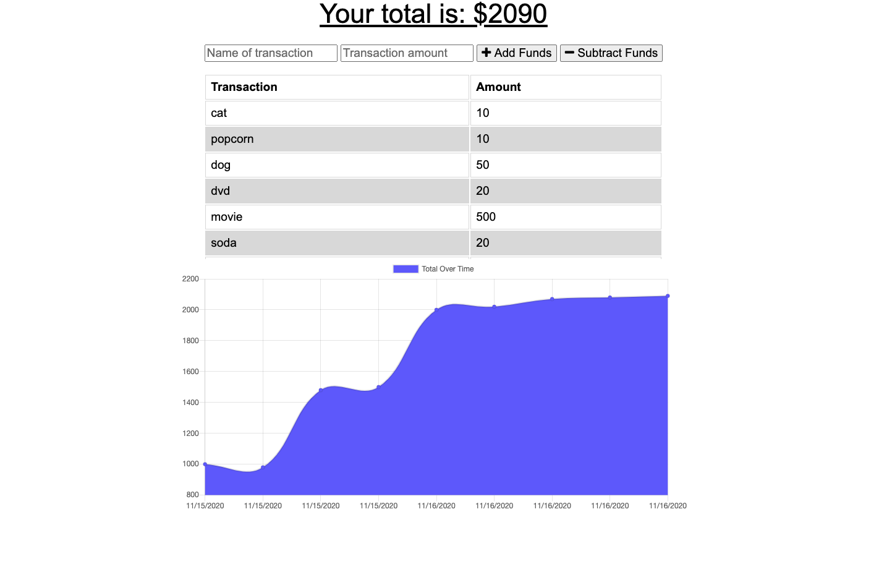

# budgetTracker
Know your personal financial status. The intention of this application is to allow the user to enter their transactions both postive and negative. This app has been reworked to include offline functionality. Download this app from your browser and use normally.
<br>
See here:
<br>
[GitHub Repository](https://github.com/KeepTheLidOnTight/budgetTracker)
<br>
[Heroku](https://powerful-island-38962.herokuapp.com/)
# Usage Instructions:
Install dependencies first, then input transactions you have that either add or take away from your budget. As you enter in values this app will produce a line graph for you to analyze your spending furthur.

# Installation:
To install dependencies use
```
npm install 
```
# Screenshot:



# Credits/Thanks:
I would personally like to thank a majority of the members of my cohort at the University of Minnesota, including my instructor and teaching assistants.
<br>
<br>
My personal tutor, Greg was of great aid to me.

# License Information: 
N/A

# Furthur Developments/Edits
Continue to develop the style of this app. Make changes to the visual elements as well..perhaps adding a pie chart along with a graph for added display.

# Questions 
If you have any questions about the repo, open an issue. You can find more of my work at [KeepTheLidOnTight](https://github.com/KeepTheLidOnTight/).